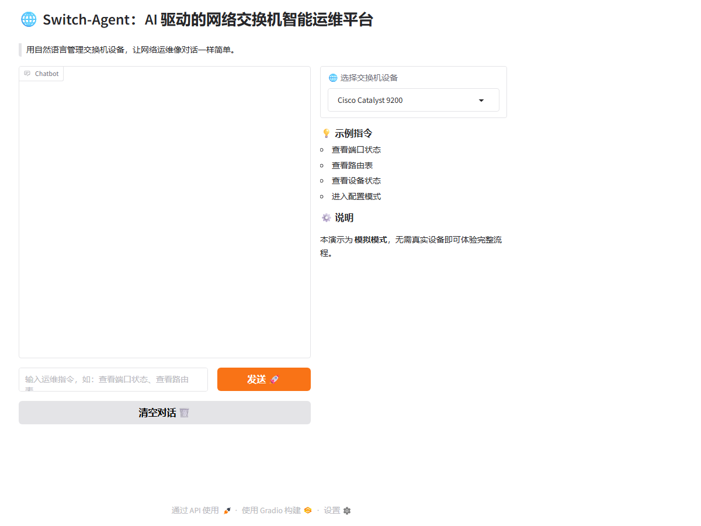
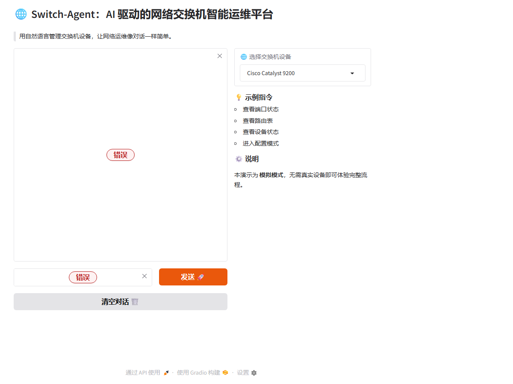

# Switch-Agent：AI 驱动的网络交换机智能运维平台

> 基于大语言模型（LLM）的网络设备自然语言运维 Agent，让网络运维像对话一样简单。

## 项目概述

Switch-Agent 是一款面向网络运维工程师的智能化运维 Agent，通过自然语言交互实现对网络交换机设备的智能管理。项目深度融合了 LLM 推理能力与传统网络运维场景，解决了网络设备命令复杂、学习成本高、人工操作易出错等行业痛点。

## 核心痛点解决

1. **命令记忆负担重**：交换机厂商命令各异（华为、H3C、思科等），工程师需要记忆大量 CLI 命令
2. **操作风险高**：手动输入命令容易出错，一条错误配置可能导致网络故障
3. **效率低下**：批量设备管理需要重复登录、逐台操作
4. **知识传承难**：网络运维经验难以结构化沉淀和复用

## 架构设计

```
┌─────────────────────────────────────────────────────────────┐
│                        用户交互层                            │
│                   (Gradio Web 界面 / API)                    │
└──────────────────────┬──────────────────────────────────────┘
                       │
┌──────────────────────▼──────────────────────────────────────┐
│                      NLP 意图解析引擎                        │
│              (intent_parser.py - 自然语言理解)               │
│     将用户自然语言 → 结构化运维意图（查询/配置/诊断）         │
└──────────────────────┬──────────────────────────────────────┘
                       │
┌──────────────────────▼──────────────────────────────────────┐
│                      LLM 推理决策层                          │
│              (llm_client.py - LangChain + LLM)               │
│     基于运维知识库生成安全命令序列，执行规则校验               │
└──────────────────────┬──────────────────────────────────────┘
                       │
┌──────────────────────▼──────────────────────────────────────┐
│                      命令生成与校验层                        │
│           (command_generator.py + 规则引擎)                  │
│     生成设备专属命令 → ACL/网络规则校验 → 安全执行            │
└──────────────────────┬──────────────────────────────────────┘
                       │
┌──────────────────────▼──────────────────────────────────────┐
│                      设备连接执行层                          │
│              (ssh_client.py - Paramiko)                      │
│     安全 SSH 连接 → 命令下发 → 结果采集 → 状态反馈            │
└─────────────────────────────────────────────────────────────┘
```

## 核心功能模块

| 模块 | 文件 | 功能说明 |
|------|------|----------|
| **NLP 意图解析** | `nlp_engine/intent_parser.py` | 将自然语言转换为结构化运维意图 |
| **LLM 推理引擎** | `llm_engine/llm_client.py` | 基于 LangChain 的大模型交互与推理 |
| **命令生成器** | `command_generator/command_generator.py` | 根据意图生成厂商专属 CLI 命令 |
| **安全连接** | `ssh_connector/ssh_client.py` | SSH 安全连接与命令执行 |
| **设备管理** | `device_manager/csv_importer.py` | 批量设备信息导入与管理 |
| **规则校验** | `config/*.md` | ACL 规则、网络规则安全校验 |
| **Web 界面** | `web_interface/app.py` | Gradio 可视化交互界面 |

## 技术栈

- **后端框架**：FastAPI
- **AI 框架**：LangChain
- **前端界面**：Gradio
- **设备连接**：Paramiko (SSH)
- **配置管理**：PyYAML
- **测试框架**：Pytest

## 核心逻辑流

1. **自然语言输入** → 用户用日常语言描述运维需求（如"查看核心交换机端口状态"）
2. **意图识别** → NLP 引擎解析用户意图，提取关键实体（设备、操作类型、目标对象）
3. **知识检索** → LLM 结合设备厂商类型、运维知识库生成对应命令序列
4. **安全校验** → 规则引擎对生成的命令进行 ACL 和网络规则校验，阻断危险操作
5. **命令执行** → 通过 SSH 安全连接目标设备，下发命令并采集返回结果
6. **结果解析** → 将设备返回的原始数据解析为结构化信息，以自然语言反馈给用户

## 快速开始

### 安装依赖

```bash
pip install -r requirements.txt
```

### 启动服务

```bash
python web_interface/app.py
```

### 配置设备

编辑 `config/` 目录下的设备配置文件，导入交换机信息。

## 项目结构

```
switch-agent/
├── command_generator/     # 命令生成模块
├── config/                # 配置文件与规则
│   ├── acl_rules.md       # ACL 安全规则
│   ├── api.yaml           # API 配置
│   └── network_rules.md   # 网络规则
├── device_manager/        # 设备管理模块
├── llm_engine/            # LLM 推理引擎
├── nlp_engine/            # NLP 意图解析
├── ssh_connector/         # SSH 连接模块
├── test/                  # 单元测试与集成测试
├── web_interface/         # Web 交互界面
├── requirements.txt       # 项目依赖
└── README.md              # 项目说明
```

## 适用场景

- 数据中心网络设备批量运维
- 企业园区网交换机日常管理
- 网络故障快速诊断与恢复
- 网络配置变更安全审核
- 运维知识沉淀与新人培训

## 未来规划

- [ ] 支持多厂商设备（华为、H3C、思科、锐捷等）
- [ ] 集成网络拓扑可视化
- [ ] 支持配置变更自动回滚
- [ ] 接入更多 LLM 模型（本地部署支持）
- [ ] 运维操作审计日志

## License

MIT License

## 作者

Yang Mengran ([@zcarefreelove](https://github.com/zcarefreelove))

## 界面预览





